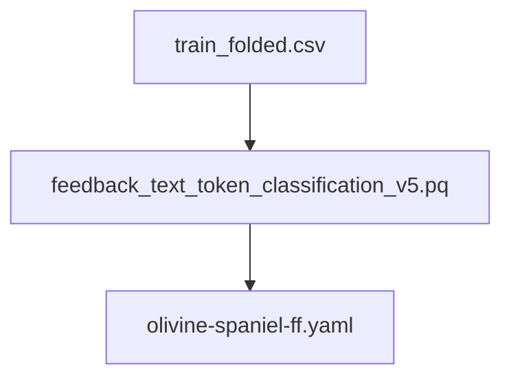
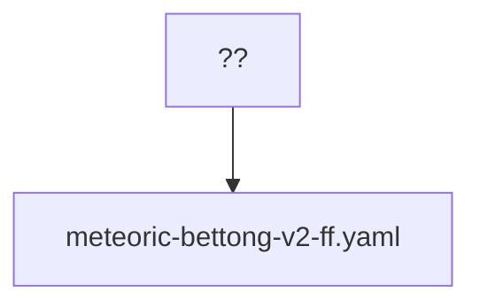
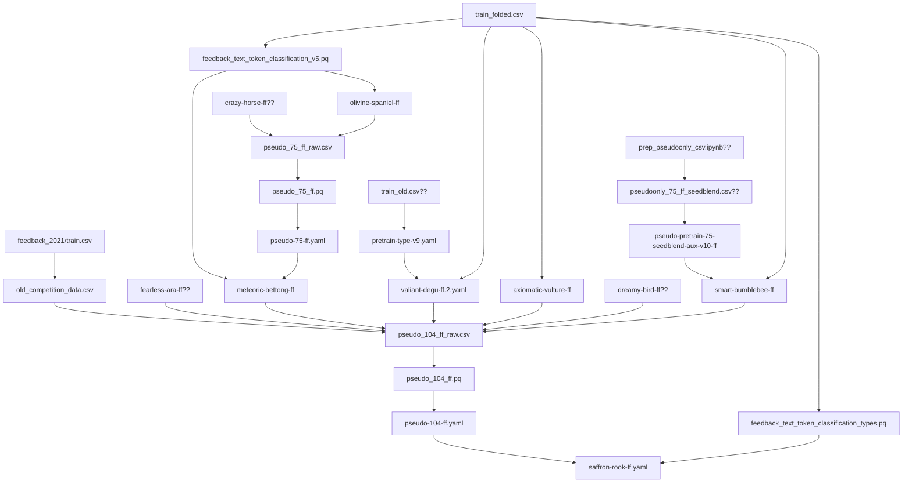
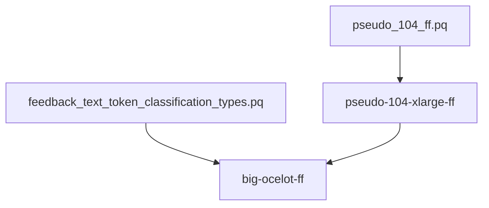
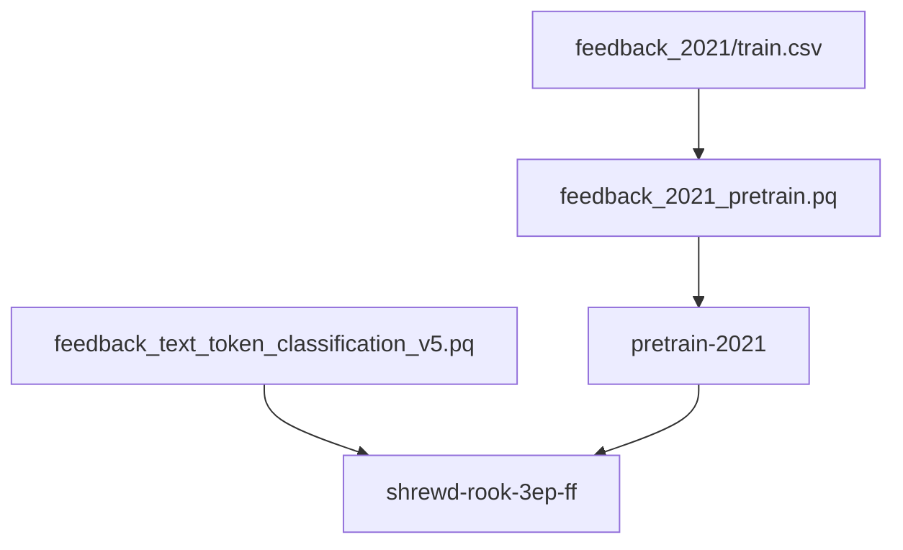
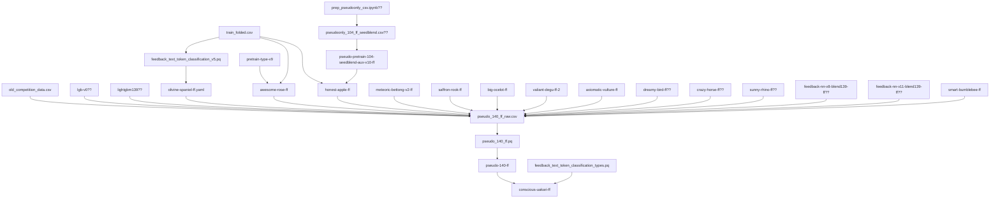
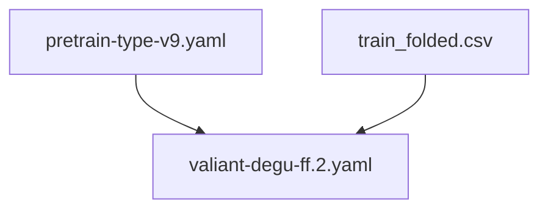
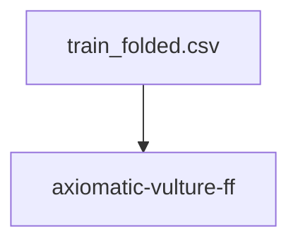
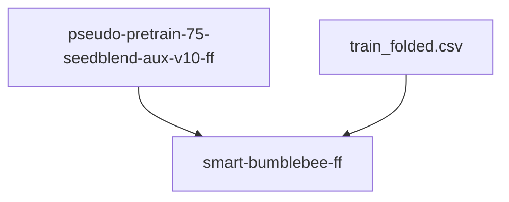
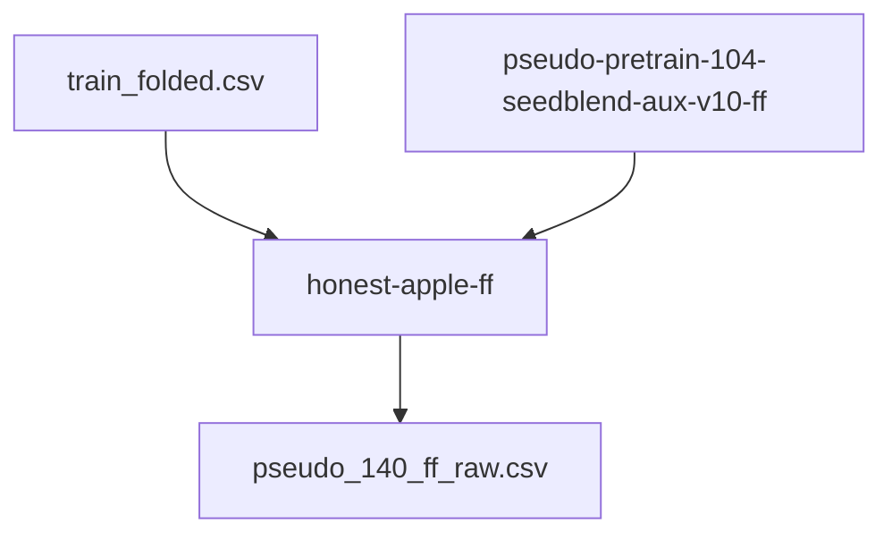

https://www.kaggle.com/code/ybabakhin/team-hydrogen-1st-place

```mermaid
flowchart TD
    train_folded.csv --> feedback_text_token_classification_v5.pq --> olivine-spaniel-ff.yaml
```

```mermaid
flowchart TD
    ?? --> meteoric-bettong-v2-ff.yaml
```

```mermaid
flowchart TD
    feedback_2021/train.csv -->
    old_competition_data.csv --> pseudo_104_ff_raw.csv
    fearless-ara-ff??  --> pseudo_104_ff_raw.csv 
    train_folded.csv --> feedback_text_token_classification_v5.pq
    feedback_text_token_classification_v5.pq --> meteoric-bettong-ff
    feedback_text_token_classification_v5.pq --> olivine-spaniel-ff
    crazy-horse-ff?? --> pseudo_75_ff_raw.csv
    olivine-spaniel-ff --> pseudo_75_ff_raw.csv
    pseudo_75_ff_raw.csv --> pseudo_75_ff.pq
    pseudo_75_ff.pq --> pseudo-75-ff.yaml
    pseudo-75-ff.yaml --> meteoric-bettong-ff
    meteoric-bettong-ff --> pseudo_104_ff_raw.csv 
    train_old.csv?? --> pretrain-type-v9.yaml
    pretrain-type-v9.yaml --> valiant-degu-ff.2.yaml
    train_folded.csv --> valiant-degu-ff.2.yaml
    valiant-degu-ff.2.yaml --> pseudo_104_ff_raw.csv  
    train_folded.csv --> axiomatic-vulture-ff
    axiomatic-vulture-ff  --> pseudo_104_ff_raw.csv 
    dreamy-bird-ff??  --> pseudo_104_ff_raw.csv 
    prep_pseudoonly_csv.ipynb?? --> pseudoonly_75_ff_seedblend.csv??
    pseudoonly_75_ff_seedblend.csv?? --> pseudo-pretrain-75-seedblend-aux-v10-ff
    pseudo-pretrain-75-seedblend-aux-v10-ff --> smart-bumblebee-ff
    train_folded.csv --> smart-bumblebee-ff
    smart-bumblebee-ff  --> pseudo_104_ff_raw.csv 
    pseudo_104_ff_raw.csv --> pseudo_104_ff.pq -->
    pseudo-104-ff.yaml --> saffron-rook-ff.yaml
    train_folded.csv -->
    feedback_text_token_classification_types.pq --> saffron-rook-ff.yaml
``` 

```mermaid
flowchart TD
    pseudo_104_ff.pq --> pseudo-104-xlarge-ff
    feedback_text_token_classification_types.pq --> big-ocelot-ff
    pseudo-104-xlarge-ff --> big-ocelot-ff
```

```mermaid
flowchart TD
    feedback_2021/train.csv --> feedback_2021_pretrain.pq
    feedback_2021_pretrain.pq --> pretrain-2021
    feedback_text_token_classification_v5.pq --> shrewd-rook-3ep-ff
    pretrain-2021 --> shrewd-rook-3ep-ff
```

```mermaid
flowchart TD
    old_competition_data.csv --> pseudo_140_ff_raw.csv

    lgb-v0?? --> pseudo_140_ff_raw.csv

    lightgbm139?? --> pseudo_140_ff_raw.csv

    train_folded.csv --> feedback_text_token_classification_v5.pq --> olivine-spaniel-ff.yaml

    train_folded.csv --> awesome-rose-ff 
    pretrain-type-v9 --> awesome-rose-ff 
    awesome-rose-ff --> pseudo_140_ff_raw.csv

    prep_pseudoonly_csv.ipynb?? --> pseudoonly_104_ff_seedblend.csv??
    pseudoonly_104_ff_seedblend.csv?? --> pseudo-pretrain-104-seedblend-aux-v10-ff
    train_folded.csv --> honest-apple-ff
    pseudo-pretrain-104-seedblend-aux-v10-ff --> honest-apple-ff
    honest-apple-ff --> pseudo_140_ff_raw.csv

    olivine-spaniel-ff.yaml --> pseudo_140_ff_raw.csv

    meteoric-bettong-v2-ff --> pseudo_140_ff_raw.csv

    saffron-rook-ff --> pseudo_140_ff_raw.csv

    big-ocelot-ff --> pseudo_140_ff_raw.csv

    valiant-degu-ff-2 --> pseudo_140_ff_raw.csv

    axiomatic-vulture-ff --> pseudo_140_ff_raw.csv

    dreamy-bird-ff?? --> pseudo_140_ff_raw.csv

    crazy-horse-ff?? --> pseudo_140_ff_raw.csv

    sunny-rhino-ff?? --> pseudo_140_ff_raw.csv

    feedback-nn-v8-blend139-ff?? --> pseudo_140_ff_raw.csv

    feedback-nn-v11-blend139-ff?? --> pseudo_140_ff_raw.csv

    smart-bumblebee-ff --> pseudo_140_ff_raw.csv

    pseudo_140_ff_raw.csv --> pseudo_140_ff.pq
    pseudo_140_ff.pq --> pseudo-140-ff
    feedback_text_token_classification_types.pq --> conscious-uakari-ff
    pseudo-140-ff --> conscious-uakari-ff
```

```mermaid
flowchart TD
    pretrain-type-v9.yaml --> valiant-degu-ff.2.yaml
    train_folded.csv --> valiant-degu-ff.2.yaml
```

```mermaid
flowchart TD
    train_folded.csv --> axiomatic-vulture-ff
```

```mermaid
flowchart TD
    pseudo-pretrain-75-seedblend-aux-v10-ff --> smart-bumblebee-ff
    train_folded.csv --> smart-bumblebee-ff
```

```mermaid
flowchart TD
    train_folded.csv --> honest-apple-ff
    pseudo-pretrain-104-seedblend-aux-v10-ff --> honest-apple-ff
    honest-apple-ff --> pseudo_140_ff_raw.csv
```

not examined yet
- funky-funk-ff
- lame-flame-ff-v2
- pastel-frog-ff